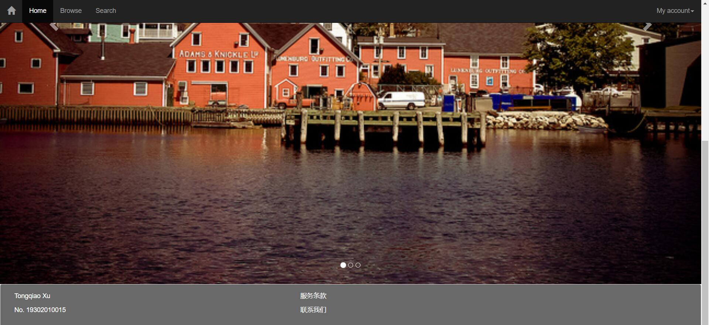

LAB 4 设计文档
===========
## 页面截图

-------------------
## 设计思路
### 设计框架
直接采用了BootStrap主页中提供的简单框架。
### 导航栏
使用了BootStrap所提供的导航栏样式，使其始终处于顶部，且反色以将其突出。所有的图标皆使用了BootStrap提供的图标素材库。
### 轮播效果
用BootStrap所提供的轮播效果实现，为了使图片能占据整个页面，设置了所有图片的宽度width=100% 。
### 页脚
页脚用了BootStrap的面板元素以实现。其颜色是使用index.css添加的。用col-md-5的方式使其能够显示两栏内容。
